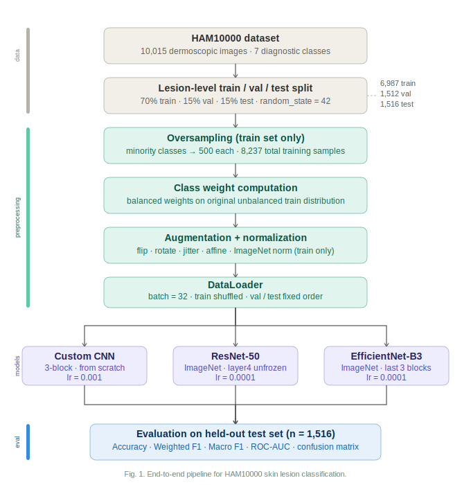
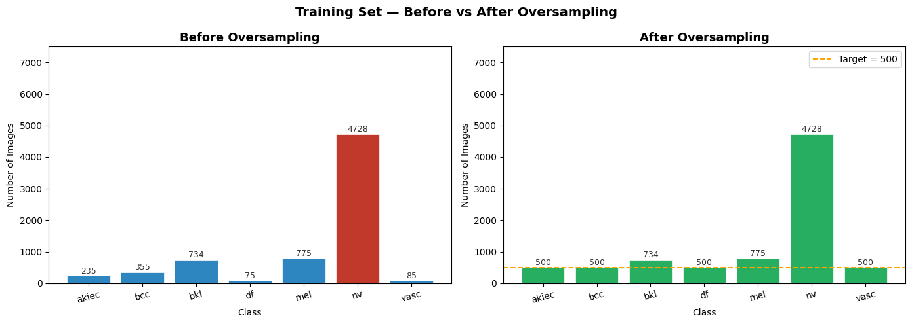
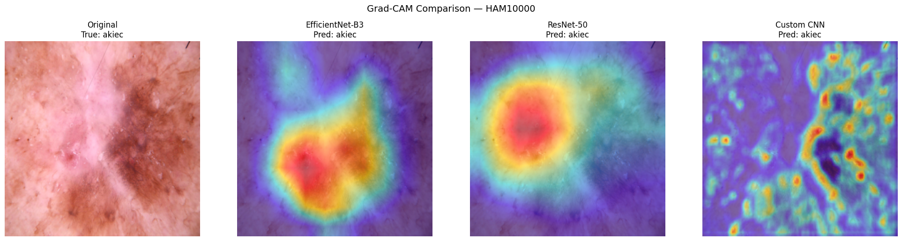
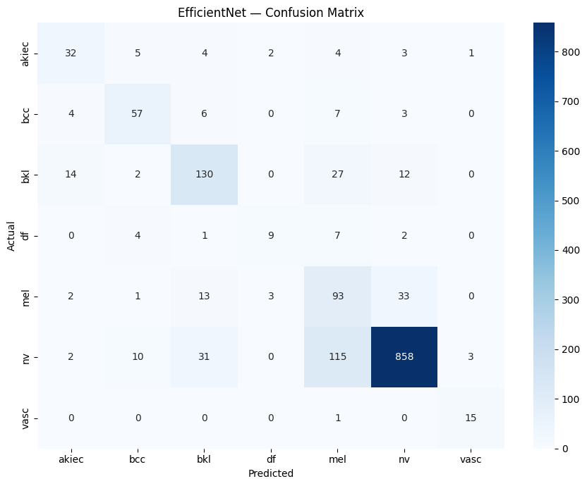
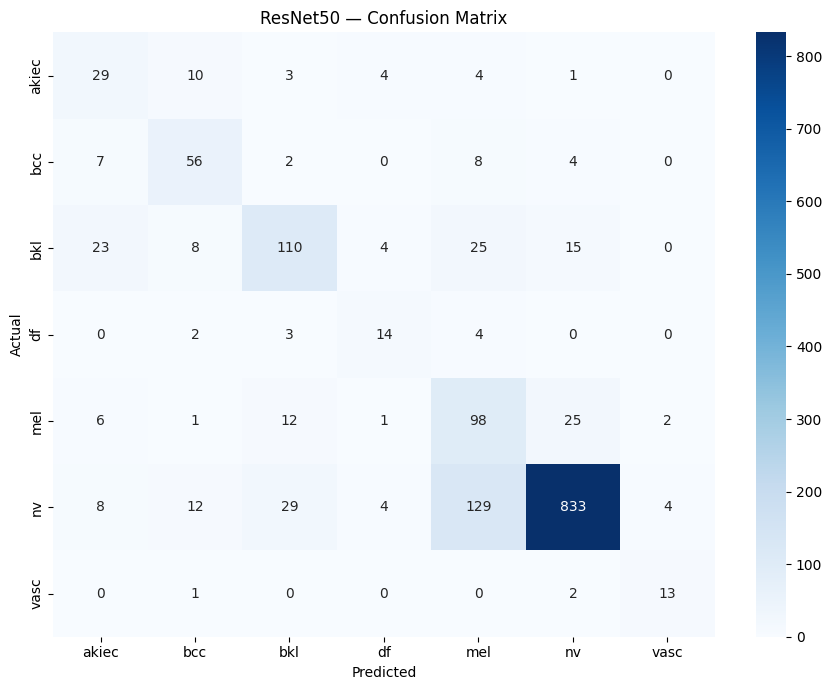

# Multi-Class Skin Cancer Classification — Deep Benchmarking

---
An end-to-end computer vision system for classifying 7 types of skin lesions using the [HAM10000](https://www.kaggle.com/datasets/kmader/skin-cancer-mnist-ham10000) dataset. This project benchmarks a custom CNN baseline against fine-tuned ResNet-50 and EfficientNet-B3 architectures, with a specific focus on handling severe class imbalance and ensuring model interpretability through Grad-CAM.

## Abstract
---
Skin cancer is the most common human malignancy. Early and accurate diagnosis is
critical for patient outcomes, yet access to expert dermatologists is unequal
globally. This project trains and compares three deep learning classifiers on the
10,015-image HAM10000 benchmark, tackling the severe **7:1 class imbalance**
through lesion-aware data splitting, minority oversampling, and weighted cross-entropy
loss. Grad-CAM visualisations demonstrate that the best-performing model focuses on
clinically meaningful regions, providing a foundation for explainable medical AI.

---

## Pipeline Overview

<p align="center">
  
</p>

---

## Technical Architecture

### Models

| Model | Strategy | Trainable params |
|---|---|---|
| **Custom CNN** | 3-block conv baseline trained from scratch | ~170 K |
| **ResNet-50** | ImageNet pre-trained; last residual block (`layer4`) unfrozen | ~25 M / 23 M frozen |
| **EfficientNet-B3** | ImageNet pre-trained; last 3 feature blocks unfrozen | ~12 M / 10 M frozen |

### Data Strategy

- **Lesion-aware split** (70 / 15 / 15) — images from the same lesion *never* span
  train and test, preventing data leakage.
- **Minority oversampling** — under-represented classes are upsampled to 500 images
  each in the training set.
- **Weighted cross-entropy** — `sklearn.utils.class_weight.compute_class_weight`
  generates per-class weights to further penalise majority-class errors.
- **Augmentation** — random horizontal/vertical flip, 30° rotation, colour jitter,
  and affine translate applied at train time only.

#### Class Distribution: Before vs. After Oversampling

The original HAM10000 dataset is dominated by melanocytic nevi (`nv`), which accounts for ~67% of all images. After applying lesion-aware splitting and oversampling minority classes to 500 images each, the training distribution is far more balanced.

<p align="center">
  
</p>

### Interpretability

Gradient-weighted Class Activation Mapping (**Grad-CAM**) is used to visualise which
image regions each model attends to. Target layers:

| Model | Target layer |
|---|---|
| EfficientNet-B3 | `features[-1][0]` — last Conv2d before avgpool |
| ResNet-50 | `layer4[-1].conv3` — last conv in final Bottleneck |
| Custom CNN | `features[8]` — Conv2d(64→128) in Block 3 |

#### Grad-CAM Visualisation

Heatmaps highlight the regions the model relies on when making a prediction. The best-performing model focuses on lesion morphology — pigmented core, irregular borders, and asymmetric regions — which aligns with what dermatologists examine clinically.

<p align="center">
  
</p>

---

## 📊 Key Results

The models were evaluated on a held-out test set ($n=1,516$) using a multi-metric approach to ensure clinical reliability. While traditional accuracy provides a general overview, **Macro F1** and **ROC-AUC** serve as the primary metrics for clinical relevance, ensuring that rare and high-risk lesion types are classified effectively.

| Metric | Custom CNN | ResNet-50 | EfficientNet-B3 | Best Model |
| :--- | :---: | :---: | :---: | :---: |
| **Accuracy** | 0.4459 | 0.7606 | **0.7876** | **EfficientNet-B3** |
| **Weighted F1** | 0.5118 | 0.7793 | **0.8020** | **EfficientNet-B3** |
| **Macro F1 (Clinical)** | 0.2506 | 0.6332 | **0.6774** | **EfficientNet-B3** |
| **Precision** | 0.7245 | 0.8157 | **0.8285** | **EfficientNet-B3** |
| **Recall** | 0.4459 | 0.7606 | **0.7876** | **EfficientNet-B3** |
| **ROC-AUC (Macro)** | 0.8479 | 0.9455 | **0.9552** | **EfficientNet-B3** |

### Confusion Matrices

Per-class confusion matrices on the held-out test set show that both transfer-learning models classify minority classes (`mel`, `akiec`, `df`, `vasc`) well, with EfficientNet-B3 showing slightly stronger diagonal dominance.

<p align="center">
  
  
</p>

<p align="center"><i>Left: EfficientNet-B3. Right: ResNet-50.</i></p>

### 🔍 Performance Analysis
* **EfficientNet-B3 Superiority**: This model outperformed the benchmarks in all categories, demonstrating the effectiveness of compound scaling for capturing fine-grained dermatological features.
* **Clinical Reliability**: The model achieved a **Macro F1 of 0.6774** and an **ROC-AUC of 0.9552**, proving its ability to distinguish between various lesion types even under extreme class imbalance.
* **Generalization**: EfficientNet-B3 achieved the highest recall (**0.7876**), which is critical in a clinical setting to minimize the risk of missed diagnoses.
* **Baseline Comparison**: The Custom CNN underperformed significantly (0.2506 Macro F1), confirming that transfer learning with pre-trained ImageNet weights is essential for high-stakes medical image analysis.

---

## Project Structure

```
skin-cancer-classification/
├── assets/             # README images & pipeline diagram
├── data/               # Dataset (not tracked — see download instructions)
├── models/             # Saved checkpoints (.pt) — excluded from Git
├── dataset.py          # SkinLesionDataset, transforms, split & oversample helpers
├── models.py           # CustomCNN, ResNet-50, EfficientNet-B3 definitions
├── train.py            # Training loop + CLI entry point
├── utils.py            # Metrics, plotting, Grad-CAM
├── predict.py          # Single-image inference script
├── requirements.txt
├── .gitignore
└── README.md
```

---

## How to Run

### 1. Clone & install

```bash
git clone https://github.com/Rythm73/Skin_Cancer_Classification.git
cd Skin_Cancer_Classification
pip install -r requirements.txt
```

### 2. Download the dataset

Download HAM10000 from [Kaggle](https://www.kaggle.com/datasets/kmader/skin-cancer-mnist-ham10000) and extract into a `data/` folder at the repo root.

### 3. Train a model

```bash
# Train EfficientNet-B3 (recommended)
python train.py --data_dir data/ --model efficientnet --epochs 35

# Train ResNet-50
python train.py --data_dir data/ --model resnet50 --epochs 35 --lr 1e-4

# Train the Custom CNN baseline
python train.py --data_dir data/ --model cnn --epochs 50 --lr 1e-3
```

All checkpoints are saved to `models/best_<model_name>.pt`.

### 4. Predict on a single image

```bash
# Basic prediction
python predict.py --image path/to/lesion.jpg \
                  --model efficientnet \
                  --checkpoint models/best_efficientnet.pt

# With Grad-CAM overlay
python predict.py --image path/to/lesion.jpg \
                  --model efficientnet \
                  --checkpoint models/best_efficientnet.pt \
                  --gradcam
```

---

## CLI Reference — `train.py`

| Argument | Default | Description |
|---|---|---|
| `--data_dir` | *(required)* | Path to HAM10000 directory |
| `--model` | `efficientnet` | `cnn` / `resnet50` / `efficientnet` |
| `--epochs` | `35` | Number of training epochs |
| `--lr` | `1e-4` | Initial learning rate (Adam) |
| `--batch_size` | `32` | Mini-batch size |
| `--oversample_target` | `500` | Target count per class after oversampling |
| `--checkpoint_dir` | `models/` | Where to save `.pt` checkpoints |
| `--no_class_weights` | `False` | Disable weighted cross-entropy |
| `--img_size` | `300` | Input image size (px) |

---

## Experiment Tracking *(optional)*

Plug in [Weights & Biases](https://wandb.ai) or [MLflow](https://mlflow.org) to log
loss curves, hyperparameters, and confusion matrices:

```bash
pip install wandb
wandb login
# Then add --use_wandb flag (implementation left as exercise)
```

---

## Disclaimer

This project is for **research and educational purposes only**. It is not a medical
device and should not be used for clinical diagnosis. Always consult a qualified
dermatologist.

---

## License

MIT
